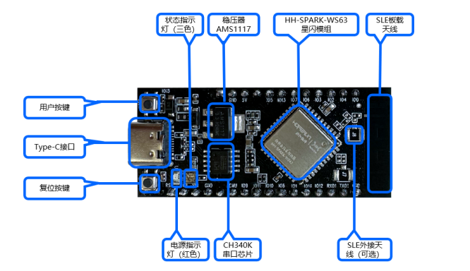
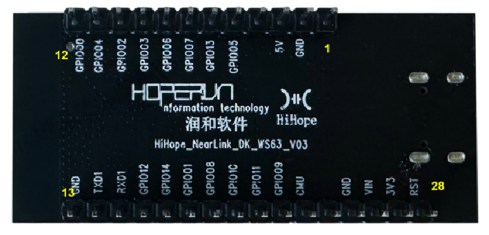

# NearLink_DK_WS63 SparkLink Development Board

## Introduction
The NearLink_DK_WS63 adopts the HiSilicon SparkLink WS63 solution, supporting 802.11b/g/n/ax wireless communication protocols; supports the SLE1.0 protocol and SLE gateway functions; can develop IoT scenario functions based on the OpenHarmony lightweight system, making it an ideal choice for the IoT smart terminal field.
The NearLink_DK_WS63 features the following:
Stable and reliable communication capabilities
Supports reliability communication algorithms such as TPC, automatic rate control, and weak interference immunity in complex environments
Flexible networking capabilities
Comprehensive network support
Supports IPv4/IPv6 network functions
Supports DHCPv4/DHCPv6 Client/Server
Supports DNS Client function
Supports mDNS function
Supports CoAP/MQTT/HTTP/JSON basic components
Powerful security engine
Hardware implementation of AES128/256 encryption and decryption algorithms
Hardware implementation of HASH-SHA256, HMAC_SHA256 algorithms
Hardware implementation of RSA, ECC signature verification algorithms
Hardware implementation of true random number generation, meeting FIPS140-2 randomness test standards
Hardware support for TLS/DTLS acceleration
Hardware support for national cryptographic algorithms SM2, SM3, SM4
Integrated internal EFUSE, supporting secure storage, secure boot, and hardware ID
Integrated internal MPU feature, supporting memory isolation
Open operating system
Open operating system OpenHarmony, providing an open, efficient, and secure system development and runtime environment
Rich mechanisms for low power consumption, small memory, high stability, and high real-time performance
Flexible protocol support and expansion capabilities
Secondary development interfaces
Multi-level development interfaces: operating system adaptation interface and system diagnostic interface, link layer interface, network layer interface

Figure 1-1 NearLink_DK_WS63 SparkLink Development Board


Figure 2 Rear view of the NearLink_DK_WS63 Sparkle development board



## Specifications
Wi-Fi

1×1 2.4GHz band (ch1～ch14)
PHY supports IEEE 802.11b/g/n/ax MAC supports IEEE 802.11d/e/i/k/v/w
Supports 802.11n 20MHz/40MHz bandwidth, supports 802.11ax 20MHz bandwidth
Supports maximum rate: 150Mbps@HT40 MCS7, 114.7Mbps@HE20 MCS9
Built-in PA and LNA, integrated TX/RX Switch, Balun, etc.
Supports STA and AP modes, supports up to 6 STA connections when acting as AP
Supports A-MPDU, A-MSDU
Supports Block-ACK
Supports QoS to meet different service quality requirements
Supports WPA/WPA2/WPA3 personal, WPS2.0
Supports RF self-calibration scheme
Supports STBC and LDPC

NearLink

NearLink low-power access technology Sparklink Low Energy (SLE)
Supports SLE 1.0
Supports SLE 1MHz/2MHz/4MHz, maximum air interface rate 12Mbps
Supports Polar channel coding
Supports SLE gateway

CPU Subsystem

High-performance 32-bit microprocessor, maximum operating frequency 240MHz
Embedded SRAM 606KB, ROM 300KB
Embedded 4MB Flash

Peripheral Interfaces

1 SPI interface, 1 QSPI interface, 2 I2C interfaces, 1 I2S interface, 3 UART interfaces, 19 GPIO interfaces, 6 ADC inputs, 8 PWM (Note: The above interfaces are implemented via multiplexing)
External crystal clock frequency 24MHz, 40MHz

Software

Wi-Fi Modes STA, Soft-AP and sniffer modes
Security Mechanisms WPS / WEP / WPA / WPA2 / WPA3
Encryption Type UART Download
Software Development SDK
Network Protocols IPv4, TCP/UDP/HTTP/FTP/MQTT

## Firmware Flashing

(1) Obtain source code

```
repo init -u https://gitee.com/openharmony/manifest.git -b master --no-repo-verify
repo sync -c
repo forall -c 'git lfs pull'
```

(2) Build tool download ./build/prebuilts_download.sh

(3) Install compilation tools sudo apt install cmake

(4) Install compilation tools python3 -m pip install --user build/hb

(5) Set compilation toolchain environment variables, the current source code path can be viewed using the pwd command

```
vim ~/.bashrc
  export PATH=/{current_source_code_path}/device/soc/hisilicon/ws63v106/sdk/tools/bin/compiler/riscv/cc_riscv32_musl_b090/cc_riscv32_musl/bin:$PATH
  export PATH=~/.local/bin:$PATH
  source ~/.bashrc
```
Execute riscv32-linux-musl-gcc -v to check if the compilation toolchain is configured successfully

(6) Compile
In the source code directory, execute hb set, select mini, select the corresponding development board. After selecting `nearlink_dk_3863`, execute the command


Execute hb build -f to compile, wait for compilation to succeed


If XTS functional testing is required, add the following parameters. After selecting `nearlink_dk_3863_xts`, execute the command

```
hb build -f --gn-args="build_xts=true"
```


(7) Connect and flash


Download the BurnTool flashing tool and unzip it

Open the flashing tool, select the corresponding serial port, open the flashing tool, click on the Option menu, select the corresponding chip. WS63E and WS63 belong to the same series, select WS63 for the chip.

Select the flash file, example path: \\wsl.localhost\Ubuntu-22.04\home\yoiannis\OpenHarmony\sdk_temp\out\nearlink_dk_3863\nearlink_dk_3863\ws63-liteos-app


Check the Auto Burn and Auto disconnect options, click connect to connect, press the RST button on the development board once to start flashing.


After flashing is complete, press the reset button on the development board


Open the serial port tool, select baud rate 115200, after powering on, the relevant serial port print information can be seen.